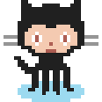

# PZNTG
Indexed color PNG image generator.

# Usage
```
pzntg.create(options) → String (base64) | Uint8Array
```
* options _(object, required)_.

Supported options:
* pixels _(matrix, required)_.
* palette _(matrix, required)_.
* scale _(positive integer, optional, default = 1)_.
* asBase64 _(boolean, optional, default = true)_.
* zlib_level _(integer from 0 to 9, optional, default = Z_DEFAULT_COMPRESSION)_.
* zlib_strategy _(integer from 0 to 4, optional, default = Z_RLE)_.
* zlib_memlevel _(integer from 1 to 9, optional, default = 8)_.
* callback _(function, optional)_.

If callback is not defined, value is returned.

Read [this](http://zlib.net/manual.html#Advanced) for more information about zlib options.

# Example

```javascript
pzntg.create({
	pixels: [
		[0,0,0,0,0,0,1,1,0,0,0,0,0,0,0,0,0,0,0,0,0,1,1,0,0,0,0,0,0],
		[0,0,0,0,0,0,1,1,1,0,0,0,1,1,1,1,1,0,0,0,1,1,1,0,0,0,0,0,0],
		[0,0,0,0,0,0,1,1,1,1,1,1,1,1,1,1,1,1,1,1,1,1,1,0,0,0,0,0,0],
		[0,0,0,0,0,0,1,1,1,1,1,1,1,1,1,1,1,1,1,1,1,1,1,0,0,0,0,0,0],
		[0,0,0,0,0,0,1,1,1,1,1,1,1,1,1,1,1,1,1,1,1,1,1,0,0,0,0,0,0],
		[0,0,0,0,0,0,1,1,1,1,1,1,1,1,1,1,1,1,1,1,1,1,1,0,0,0,0,0,0],
		[0,0,0,0,0,1,1,1,1,1,1,1,1,1,1,1,1,1,1,1,1,1,1,1,0,0,0,0,0],
		[0,0,0,0,0,1,1,1,1,2,2,2,2,1,1,1,2,2,2,2,1,1,1,1,0,0,0,0,0],
		[0,0,0,0,0,1,1,1,2,2,2,2,2,2,2,2,2,2,2,2,2,1,1,1,0,0,0,0,0],
		[0,0,0,0,0,1,1,2,2,2,4,2,2,2,2,2,2,2,4,2,2,2,1,1,0,0,0,0,0],
		[0,5,5,5,5,1,1,2,2,4,3,4,2,2,2,2,2,4,3,4,2,2,1,1,5,5,5,5,0],
		[0,0,0,0,0,1,1,2,2,4,3,4,2,2,2,2,2,4,3,4,2,2,1,1,0,0,0,0,0],
		[0,5,5,5,5,1,1,2,2,2,4,2,2,2,3,2,2,2,4,2,2,2,1,1,5,5,5,5,0],
		[0,0,0,0,0,0,1,1,1,2,2,2,2,2,2,2,2,2,2,2,1,1,1,0,0,0,0,0,0],
		[0,0,0,0,0,0,0,0,1,1,2,2,2,3,3,3,2,2,2,1,1,0,0,0,0,0,0,0,0],
		[0,0,0,0,0,0,0,0,0,1,1,1,1,1,1,1,1,1,1,1,0,0,0,0,0,0,0,0,0],
		[0,0,0,0,1,1,0,0,0,0,0,1,1,1,1,1,1,1,0,0,0,0,0,0,0,0,0,0,0],
		[0,0,0,0,0,1,1,0,0,0,0,1,1,1,1,1,1,1,0,0,0,0,0,0,0,0,0,0,0],
		[0,0,0,0,0,1,1,1,0,0,1,1,1,1,1,1,1,1,1,0,0,0,0,0,0,0,0,0,0],
		[0,0,0,0,0,0,1,1,1,1,1,1,1,1,1,1,1,1,1,1,0,0,0,0,0,0,0,0,0],
		[0,0,0,0,0,0,0,1,1,1,1,0,1,1,0,1,1,0,1,1,0,0,0,0,0,0,0,0,0],
		[0,0,0,0,0,0,0,0,0,1,1,0,1,1,0,1,1,0,1,1,0,0,0,0,0,0,0,0,0],
		[0,0,0,0,0,0,0,0,0,1,1,0,1,1,0,1,1,0,1,1,0,0,0,0,0,0,0,0,0],
		[0,0,0,0,0,0,0,0,0,1,1,6,1,1,6,1,1,6,1,1,0,0,0,0,0,0,0,0,0],
		[0,0,0,0,0,0,6,6,6,1,1,6,1,1,6,1,1,6,1,1,6,6,6,0,0,0,0,0,0],
		[0,0,0,0,0,6,6,6,1,1,6,6,1,1,6,1,1,6,6,1,1,6,6,6,0,0,0,0,0],
		[0,0,0,0,0,6,6,6,6,6,6,6,1,6,6,6,1,6,6,6,6,6,6,6,0,0,0,0,0],
		[0,0,0,0,0,0,6,6,6,6,6,6,6,6,6,6,6,6,6,6,6,6,6,0,0,0,0,0,0],
		[0,0,0,0,0,0,0,0,0,6,6,6,6,6,6,6,6,6,6,6,0,0,0,0,0,0,0,0,0]
	],
	palette: [
		[0,  0,   0,   0,   0],
		[0, 32,  32,  32, 255],
		[0,244, 202, 177, 255],
		[0,172,  92,  81, 255],
		[0,255, 255, 255, 255],
		[0,148, 148, 148, 255],
		[0,156, 218, 240, 255]
	],
	scale: 4
});
```
